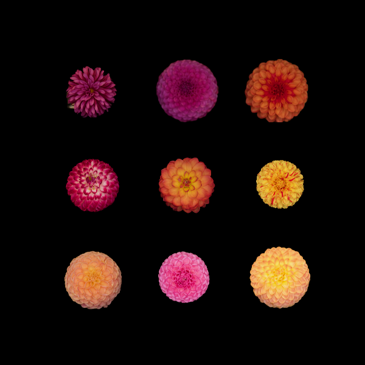
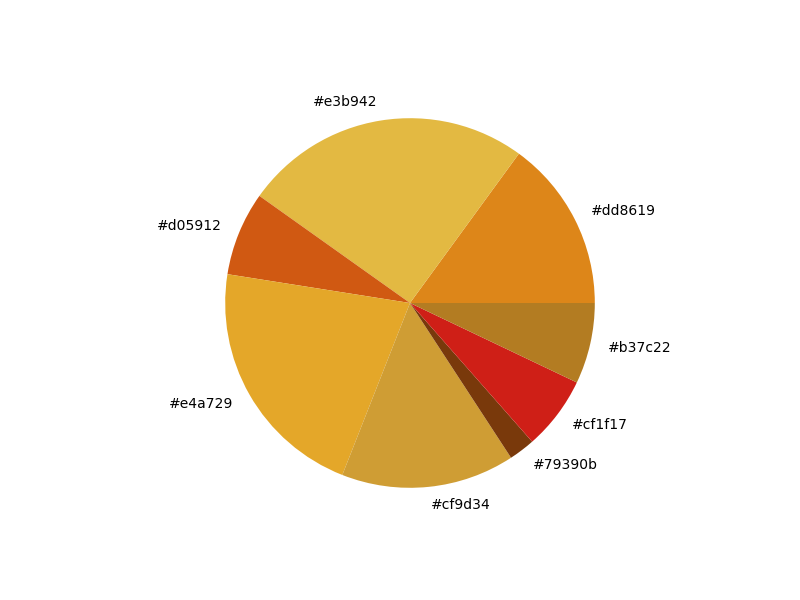

# Bouquet
Created for BIOL 7180-D01 Scripting for Biologist @ Auburn University. This program was created to generate a final figure of images sorted by RGB, as well as create a pallete of colors from individial images. 

## Getting Started
Before running Bouquet, we will create a virtual environment using Python3 venv
```
mkdir venvs
cd venvs
module load python
python3 -m venv Bouquet
```
Now that we have created a folder for the Bouqet program, we will active that virtual environment.
```
source Bouquet/bin/activate
```
Now we can install all the required packages.
```
pip install -r requirements.txt
```
Within this requirements.txt file are installing the following packages:
- math
- cv2
- os
- glob
- time
- sys
- sklearn.cluster
- collections
- skimage.color
- matplotlib
- numpy
- Pillow
- pathlib
- rembg 

## Running Bouquet
The main line of code used to run Bouquet is:
```
python3 Bouquet.py
```

With flags:
> -h 	--help					Shows the help message and exits the program
>
> -s	--single				Used for single image analysis
>
> -a	--arrangemnt			Uses the arrangement function of Bouquet, requires the -d flag
>
> -d 	--directory				The directory where the input images are stored
>
> -p	--project_name			The name of the project
>
> -c	--color_numbers			The number of colors required that will be outputted in the single use function
>
> -l	--light_mode			Puts the arrangement final image with a white backgroud
>
> -r	--remove_background		Removes the background of all the images in given directory 

### First Step in Running Bouquet
Before running the single or the arrangement we need to remove the background from all the images sorted in the directory.
This step can be completed with:
```
python3 Bouquet.py -r -d <directory>
```

### Single Use
One of the main functions of the Bouquet program will allow us to find the most dominant colors from that image. 
```
python3 Bouquet.py -s <image> -c <number of colors> 
```

### Arrangement Use
The second of the two main functions will take all the images in given directory and generate an image that contains all the images once they have been sorted by their RGB values
```
python3 Bouquet.py -a -d <directory> -p <project name>
```

## Tutorial of Bouquet
To test the start of the Bouquet script we will run the program on the test images provided. 
The first step will be to remove the backgrounds of all the images: 
```
python3 Bouquet.py -r -d Test_Images
```
Next we will run the arrangement function to put all the images a final figure we will call Test_Figure.png
```
python3 Bouquet.py -a -d Test_Images -p Test_Figure
```
That will create an image like the one below
---

---

Next we will use the -s function to create a color pallete from the images of Greendor.png
```
python3 Bouquet.py -s Greendor.png -c 8
```
This will create an image like below:
---

---
